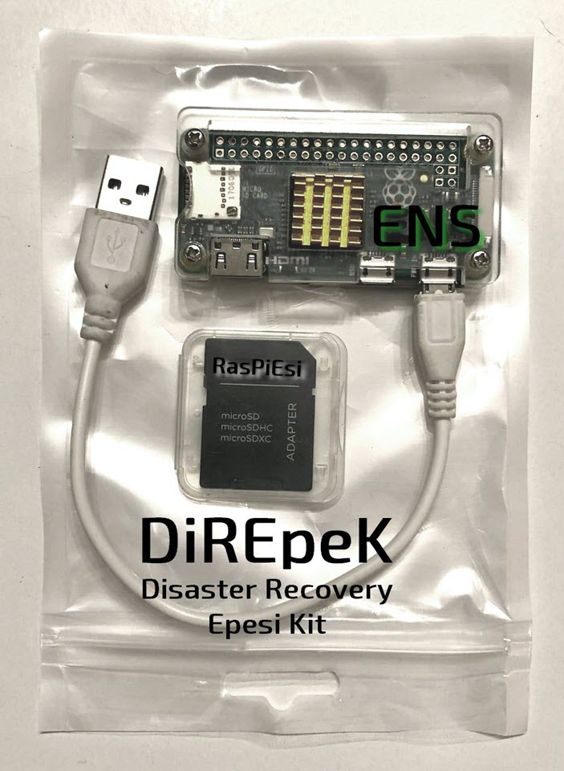

# DiREpeK
## Disaster Recovery Epesi Kit

For personal Epesi CRM installation with small database you can recover Epesi even into a very small Raspberry Pi Zero.
For larger installations recovery should be done on a Raspberry Pi with minimum of 1 GB of RAM or more, preferably the most recent RPi4.

Image based on https://github.com/jtylek/RasPiEsi
with added Chrome configured in kiosk mode to run Recovery Wizard.

Allow upload/download compressed, for example Softaculous zipped, backup file and:
- uncompress the backup
- scan for /data/ and especially /data/config.php file
- show results of the scan
- recreate a database and user in MariaDB from recovered /config.php
- show results of database import: number of tables, installed modules, etc.
- recreate /Epesi/ directory structure including /Premium/ /Custom/ modules
- start Recovered Epesi instance

Additional tool: Forgotten admin password reset.
